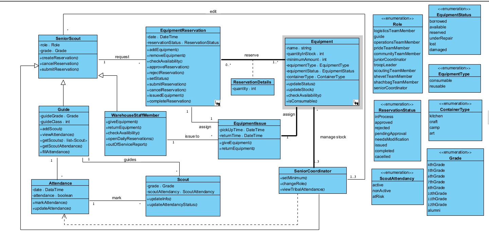

# Class Diagram

## Class Definitions & Relationships

### Entity: ReservationRequest

**Description:** Represents an equipment reservation request made by a scout for an upcoming activity.

**Attributes:**
- id: String (Primary Key)
- reservationStatus: String (enum: "pending", "approved", "rejected", "cancelled")
- requestDate: DateTime
- activityDate: DateTime
- requestedById: String (Foreign Key to SeniorScout)
- activityId: String (Foreign Key to Activity)

**Methods:**
- createReservation()
- updateStatus()
- cancelReservation()
- getReservationDetails()

**Relationships:**
- One-to-Many with ReservationDetails (1 request can have multiple line items)
- Many-to-One with SeniorScout (request is made by a scout)
- Many-to-One with Activity (request is for a specific activity)
- Many-to-One with EquipmentIssue (references the equipment checkout)

---

### Entity: ReservationDetails

**Description:** Line items within a reservation request, specifying which equipment and quantities are needed.

**Attributes:**
- id: String (Primary Key)
- entry: Integer
- quantity: Integer
- equipmentId: String (Foreign Key to Equipment)
- reservationRequestId: String (Foreign Key to ReservationRequest)
- addedEquipment: Boolean

**Relationships:**
- Many-to-One with ReservationRequest (belongs to a specific request)
- Many-to-One with Equipment (specifies which equipment item)

---

### Entity: Equipment

**Description:** Represents a physical equipment item in the warehouse.

**Attributes:**
- id: String (Primary Key)
- name: String
- category: String
- description: String
- equipmentType: String
- containerType: String
- containerLocation: String
- quantity: Integer
- minimumQuantity: Integer
- status: String (enum: "available", "borrowed", "damaged", "missing")
- lastUpdated: DateTime
- notes: String

**Methods:**
- createEquipment()
- updateQuantity()
- updateStatus()
- checkAvailability()
- getEquipmentDetails()

**Relationships:**
- One-to-Many with ReservationDetails (equipment can be in multiple reservations)
- One-to-Many with EquipmentIssue (one equipment can have multiple issue records)
- One-to-Many with EquipmentLog (tracks all transactions)

---

### Entity: EquipmentIssue

**Description:** Records the checkout/distribution of equipment to guides for activities.

**Attributes:**
- id: String (Primary Key)
- issueDate: DateTime
- returnDate: DateTime (nullable)
- equipmentId: String (Foreign Key to Equipment)
- issuedToId: String (Foreign Key to SeniorScout)
- guideId: String (Foreign Key to Guide)
- reservationId: String (Foreign Key to ReservationRequest)
- status: String (enum: "issued", "returned", "partially_returned", "not_returned")
- condition: String (enum: "good", "damaged", "missing")

**Methods:**
- issueEquipment()
- returnEquipment()
- updateCondition()
- getIssueHistory()

**Relationships:**
- Many-to-One with Equipment (references which equipment)
- Many-to-One with SeniorScout (who issued it)
- Many-to-One with Guide (issued to which guide)
- Many-to-One with ReservationRequest (associated request)

---

### Entity: Attendance

**Description:** Records attendance of scouts in activities.

**Attributes:**
- id: String (Primary Key)
- scoutId: String (Foreign Key to Scout)
- activityId: String (Foreign Key to Activity)
- attendanceStatus: String (enum: "present", "absent", "late")
- recordedDate: DateTime
- recordedBy: String (Foreign Key to Guide)

**Constraints:**
- Attendance can be submitted only once per activity per scout

**Methods:**
- recordAttendance()
- updateAttendance()
- getAttendanceRecord()

**Relationships:**
- Many-to-One with Scout (which scout)
- Many-to-One with Activity (in which activity)
- Many-to-One with Guide (recorded by which guide)

---

### Entity: Activity

**Description:** Represents an activity, event, or outing organized by the troop.

**Attributes:**
- id: String (Primary Key)
- name: String
- description: String
- activityDate: DateTime
- dueDate: DateTime
- status: String (enum: "in_progress", "approved", "rejected")
- createdBy: String (Foreign Key to Guide)
- guidelines: String
- contentDocument: String (URL/path to uploaded doc)
- lastModified: DateTime

**Methods:**
- createActivity()
- updateActivity()
- submitForApproval()
- approveActivity()
- rejectActivity()

**Relationships:**
- One-to-Many with Attendance (multiple scouts attend)
- One-to-Many with ReservationRequest (equipment reserved for this activity)
- Many-to-One with Guide (created by a guide)
- One-to-Many with EquipmentIssue (equipment issued for this activity)

---

### Entity: Guide

**Description:** A group leader/instructor in the troop who guides activities.

**Attributes:**
- id: String (Primary Key)
- name: String
- email: String
- phoneNumber: String
- role: String
- scoutClass: String (e.g., "G1", "G2")
- troopId: String (Foreign Key to Troop)
- startDate: DateTime
- accountStatus: String

**Methods:**
- createGuide()
- updateProfile()
- assignRole()
- getAssignedActivities()

**Relationships:**
- One-to-Many with Activity (creates/leads activities)
- One-to-Many with Attendance (records attendance)
- Many-to-One with Troop (belongs to a troop)
- One-to-Many with SeniorScout (manages senior scouts)

---

### Entity: SeniorScout

**Description:** Senior scout member (Shkab"g) responsible for mentoring and leadership roles.

**Attributes:**
- id: String (Primary Key)
- name: String
- scoutClass: String
- rut (ראשות ותיקות): String (seniority/leadership roles)
- yearsOfService: Integer
- mentoringSpecialties: String[]
- attendanceRecord: Integer (count of attended activities)
- performanceRating: Integer (0-100)
- currentAssignments: String[]

**Methods:**
- createSeniorScout()
- updateProfile()
- recordPerformance()
- assignRole()
- getPerformanceScore()

**Relationships:**
- One-to-Many with ReservationRequest (submits equipment requests)
- Many-to-One with Guide (supervised by a guide)
- One-to-Many with EquipmentIssue (receives equipment)

---

### Entity: Scout

**Description:** A young member of the troop.

**Attributes:**
- id: String (Primary Key)
- name: String
- level: String (age group/scout level)
- parentDetails: String (parent name, contact)
- sensitivities: String[] (allergies, medical conditions, etc.)
- startDate: DateTime
- troopId: String (Foreign Key to Troop)
- status: String (enum: "active", "inactive", "graduated")

**Methods:**
- createScout()
- updateProfile()
- recordSensitivity()
- trackAttendance()

**Relationships:**
- One-to-Many with Attendance (attends activities)
- Many-to-One with Troop (belongs to a troop)

---

### Entity: Troop

**Description:** Represents a scout troop organization.

**Attributes:**
- id: String (Primary Key)
- name: String
- location: String
- coordinatorId: String (Foreign Key to SeniorCoordinator)
- createdDate: DateTime
- grade: String (age level served)
- memberCount: Integer
- status: String

**Methods:**
- createTroop()
- addMember()
- removeMember()
- getTroopStatistics()

**Relationships:**
- One-to-Many with Scout (contains scouts)
- One-to-Many with Guide (contains guides)
- One-to-Many with Activity (organizes activities)
- Many-to-One with SeniorCoordinator (managed by coordinator)

---

### Entity: SeniorCoordinator

**Description:** Coordinator responsible for overall troop management and oversight.

**Attributes:**
- id: String (Primary Key)
- name: String
- email: String
- responsibility: String
- troopId: String (Foreign Key to Troop)
- yearsOfExperience: Integer
- permissions: String[] (list of administrative privileges)

**Methods:**
- manageTroopPolicy()
- overseeActivities()
- generateReports()
- managePermissions()

**Relationships:**
- One-to-Many with Troop (manages multiple troops)
- One-to-Many with SeniorScout (oversees senior scouts)
- One-to-Many with Activity (reviews/approves activities)

---

## Key Relationships Summary

| From | To | Cardinality | Type | Description |
|------|-----|---|---|---|
| ReservationRequest | SeniorScout | Many-to-One | | Request created by a scout |
| ReservationRequest | Activity | Many-to-One | | Request for a specific activity |
| ReservationRequest | ReservationDetails | One-to-Many | | Request contains multiple line items |
| ReservationDetails | Equipment | Many-to-One | | Line item specifies equipment needed |
| EquipmentIssue | Equipment | Many-to-One | | Issue references equipment |
| EquipmentIssue | SeniorScout | Many-to-One | | Issue issued by a senior scout |
| EquipmentIssue | Guide | Many-to-One | | Issue issued to a guide |
| Activity | Guide | Many-to-One | | Activity created by a guide |
| Activity | Attendance | One-to-Many | | Activity has multiple attendance records |
| Activity | ReservationRequest | One-to-Many | | Activity has equipment reservations |
| Attendance | Scout | Many-to-One | | Attendance record for a scout |
| Attendance | Guide | Many-to-One | | Attendance recorded by a guide |
| Guide | Troop | Many-to-One | | Guide belongs to a troop |
| SeniorScout | Guide | Many-to-One | | SeniorScout supervised by a guide |
| Scout | Troop | Many-to-One | | Scout belongs to a troop |
| SeniorCoordinator | Troop | One-to-Many | | Coordinator manages troops |

---

## Design Assumptions

1. **Unique Equipment Tracking:** Each equipment item is uniquely identifiable and tracked from reservation through return.

2. **Activity-Centric Design:** Activities are the central hub connecting reservations, attendance, and resource allocation.

3. **Role-Based Access:** Users have role-specific permissions (Guide, Senior Scout, Coordinator) that determine what data they can access and modify.

4. **Temporal Tracking:** All major events (reservations, issues, returns, attendance) are timestamped for audit and historical analysis.

5. **Soft Deletes:** Records are not physically deleted but marked as "cancelled" or "inactive" to preserve historical data integrity.

6. **Scout-Centric Analytics:** The system maintains detailed scout attendance records to enable early identification of at-risk scouts (potential dropouts).

7. **Consumable vs. Reusable:** Equipment is categorized to support different handling (consumables are decremented on use, reusables are tracked for return).
