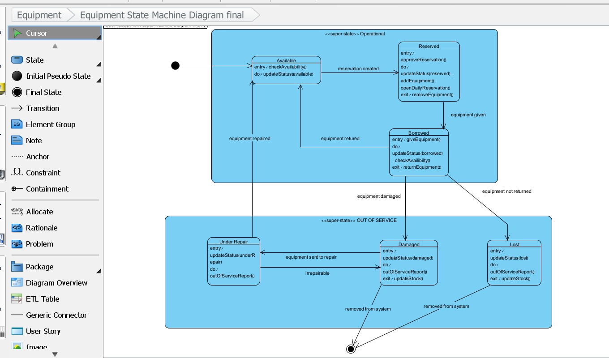

# State Diagrams

## 1. Equipment State Diagram

### States

**Available**
- Initial state when equipment is in good condition and stored in the warehouse
- Equipment is ready for reservation and distribution

**Reserved**
- Equipment has been requested and approved for a future activity
- Equipment cannot be reserved by others during this state
- Duration is temporary until activity date

**Borrowed (In Use)**
- Equipment has been issued to a guide for an activity
- Equipment is away from the warehouse
- No new reservations accepted

**In Warehouse**
- Equipment has been returned from an activity
- Equipment is stored and available again
- May transition to "Available" if in good condition or "Damaged" if issues detected

**Damaged**
- Equipment returned in non-working condition
- Requires repair before returning to "Available"
- Maintenance task is created

**Repair**
- Equipment is being fixed
- Duration depends on repair scope
- Transitions to "Available" upon successful repair

**Missing**
- Equipment was issued but not returned
- Investigation status
- May transition back to "Available" if found or removed from inventory if permanently lost

### Transitions & Guards

| From | To | Event | Guard/Condition | Entry Action |
|------|--|----|---|---|
| Available | Reserved | createReservation() | Equipment quantity sufficient | Reserve inventory slot |
| Reserved | Available | cancelReservation() | User authorization confirmed | Release reserved slot |
| Reserved | Borrowed | issueEquipment() | Activity date reached, reservation approved | Log issue time, update loan status |
| Borrowed | In Warehouse | returnEquipment() | Equipment received by warehouse staff | Record return, assess condition |
| In Warehouse | Available | confirmCondition() | Equipment verified in good condition | Clear return status |
| In Warehouse | Damaged | reportDamage() | Warehouse staff confirms damage | Create maintenance ticket |
| Damaged | Repair | submitForRepair() | Maintenance task created | Assign repair technician |
| Repair | Available | completionConfirmed() | Repair verified successful | Close maintenance ticket |
| Borrowed | Missing | reportMissing() | Time threshold passed, item not returned | Create investigation log |
| Missing | Available | itemFound() | Investigation resolved, item located | Update location record |

---

## 2. Activity State Diagram

### States

**In Progress**
- Initial state when guide starts writing the activity plan
- Multiple edits allowed
- Not yet submitted for approval

**Submitted**
- Activity plan uploaded and awaiting review
- Guide can still edit before review feedback
- Troop leader can view and prepare feedback

**Under Review**
- Troop leader (RagShaGad) is actively reviewing the activity
- Notes and corrections are being written
- Activity is locked from further guide edits

**Reviewed**
- Troop leader has completed review and added notes
- Status indicates feedback is ready for guide
- Guide can now view comments and prepare revisions

**Approved**
- Troop leader has approved the activity after review
- Activity is finalized and locked from further edits
- Ready for execution

**Rejected**
- Troop leader has rejected the activity
- Indicates issues that prevent execution
- Guide must create revised version

### Transitions & Guards

| From | To | Event | Guard/Condition | Entry Action |
|------|--|----|---|---|
| In Progress | Submitted | submitForApproval() | Content complete, document uploaded | Log submission timestamp |
| Submitted | In Progress | editDraft() | Guide authorization confirmed | Update modification timestamp |
| Submitted | Under Review | startReview() | Troop leader access granted | Lock for guide editing |
| Under Review | Reviewed | completeReview() | Notes written by troop leader | Log review completion, notify guide |
| Reviewed | In Progress | requestRevisions() | Guide begins edits per feedback | Unlock for guide editing |
| Reviewed | Approved | approveActivity() | Troop leader confirms approval | Send approval notification |
| Reviewed | Rejected | rejectActivity() | Troop leader indicates rejection reasons | Mark for revision, notify guide |
| Rejected | In Progress | reviseActivity() | New submission version | Reset to draft state |
| Approved | Executed | recordExecution() | Activity date passed | Log execution timestamp |

---

## 3. Reservation State Diagram

### States

**Pending**
- Initial state when scout submits equipment reservation
- Request awaits processing
- Equipment availability being verified

**Approved**
- Reservation has been confirmed
- Equipment is committed for the activity
- Awaiting activity date for equipment issuance

**Active**
- Activity date has arrived
- Equipment is being issued to guide
- Reservation transitioning to active use

**Completed**
- Equipment has been returned
- Reservation cycle complete
- Historical record maintained

**Cancelled**
- Reservation was cancelled before execution
- Equipment reservation released back to available inventory
- Reason documented

**Denied**
- Reservation request was not approved
- Insufficient equipment or other constraint
- Alternative resolution offered to scout

### Transitions & Guards

| From | To | Event | Guard/Condition | Entry Action |
|------|--|----|---|---|
| Pending | Approved | approveReservation() | Equipment available in sufficient quantity | Allocate inventory, set approval timestamp |
| Pending | Denied | denyReservation() | Insufficient inventory or other constraint | Notify scout of reason, release request |
| Pending | Cancelled | cancelReservation() | Scout initiates cancellation | Release held inventory |
| Approved | Active | activateReservation() | Activity date reached | Issue equipment to guide |
| Approved | Cancelled | cancelReservation() | Scout initiates before activity date | Release reserved equipment back to available |
| Active | Completed | closeReservation() | Equipment returned and verified | Log completion, update history |
| Active | Completed | partialReturn() | Some equipment returned, some missing | Document partial fulfillment |
| Denied | Pending | resubmitReservation() | Scout modifies request | Reset to pending review |

---

## 4. Scout Attendance State Diagram

### States

**Not Submitted**
- Initial state - no attendance record yet for this scout/activity
- Guide has not recorded attendance

**Submitted**
- Initial attendance data recorded (present/absent/late)
- First submission complete
- Can be updated if needed

**Verified**
- Attendance record has been verified by system
- Submitted within time limit
- Marked as official record

**Flagged**
- System detected pattern (e.g., 3+ consecutive absences)
- Troop leader alerted for intervention
- Requires follow-up action

### Transitions & Guards

| From | To | Event | Guard/Condition | Entry Action |
|------|--|----|---|---|
| Not Submitted | Submitted | recordAttendance() | Guide authorization, activity completed | Record status (present/absent/late), timestamp |
| Submitted | Verified | verifyAttendance() | Submission within deadline | System confirmation, eligible for reports |
| Submitted | Submitted | updateAttendance() | Activity in review period | Allow corrections to status |
| Verified | Flagged | detectPattern() | 3+ consecutive absences detected | Send alert to coordinator, flag scout profile |
| Flagged | Verified | clearFlag() | Intervention action taken or pattern broken | Remove alert, resume normal status |
