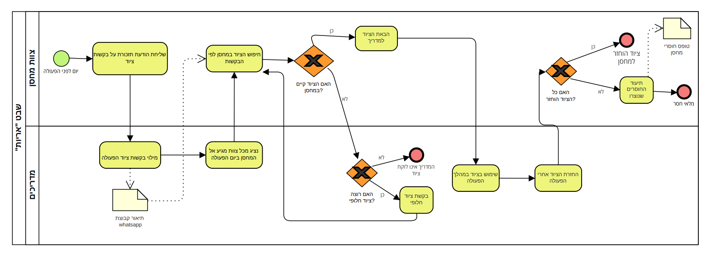
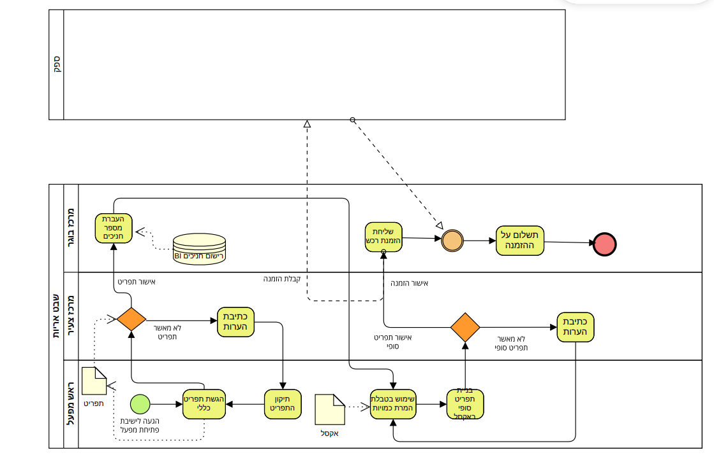
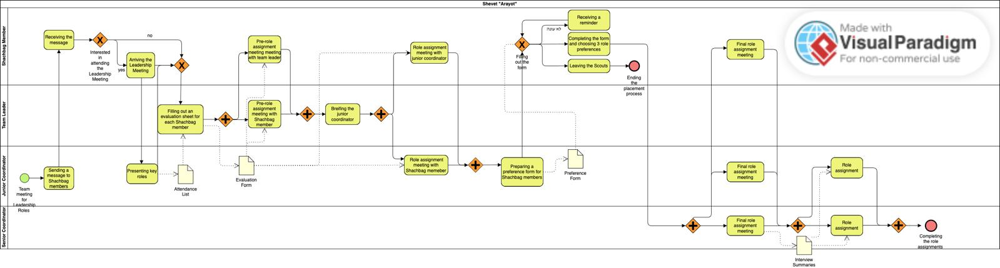

# תיאור התהליכים העסקיים

## תהליך עסקי 1: ניהול רכש, מלאי ולוגיסטיקה

תהליך זה מרכז את כלל הפעילות הלוגיסטית בשבט, החל מהתנהלות שוטפת מול המחסן ועד להזמנות מורכבות מול ספקים חיצוניים.

### 1. ניהול סבב ציוד לפעולות (הוצאה והחזרה)

המדריכים שולחים רשימת ציוד בתיאור קבוצת הוואטסאפ עד השעה 16:00 ביום הקודם. צוות המחסן מוציא את הציוד, ובסיום הפעילות הציוד מוחזר באופן לא מבוקר ללא נוכחות קבועה של איש מחסן, מה שמוביל לאובדן ציוד.

### 2. תכנון וביצוע הזמנת מזון למפעלים

חברי צוות מפעלים מחשבים כמויות מזון באמצעות קובץ אקסל הכולל טבלת המרת כמויות. רשימת הדרישות מועברת למרכזת הבוגרת, שמבצעת את ההזמנה בפועל מול ספקים במערכת ה-SAP. בסיום המפעל, עודפי מזון רבים נזרקים בשל חוסר יכולת מעקב או תנאי אחסון לקויים.

### 3. בקרה וספירת מלאי תקופתית

לפני מפעלים גדולים, צוות המחסן מבצע ספירת ציוד ומתעד זאת בקובץ אקסל. במידה ומתגלה חוסר, מועברת רשימה למרכזת לצורך הזמנת ציוד חדש.

### 4. ניהול חשבוניות והחזרי הוצאות

חברי שכב"ג הרוכשים ציוד באופן עצמאי נדרשים להגיש חשבוניות מס למרכזת הבוגרת. המרכזת מרכזת את הנתונים לצורך דיווח חודשי להנהגה ובקרה על השימוש בכרטיס האשראי השבטי.

### BPMN

---

## תהליך עסקי 2: ניהול ההתנהלות השוטפת של השכבה הבוגרת (שכב"ג)

תהליך זה עוסק בניהול המשאב האנושי בשבט – החל ממשימות שגרתיות, דרך שיבוצם לתפקידים ועד לבקרה על תפקודם השוטף.

### 1. תהליך שיבוץ שנתי

התהליך מתחיל בשיחות "קדם-שיבוץ" בין המדריכים לראשג"דים או מרכזים כדי להבין רצונות ולשקף את מצב המדריך. השכב"גיסטים ממלאים טופס (Forms) ובו הם מציינים שלושה תפקידים מועדפים ומנמקים את בחירתם. לאחר מכן מתקיימות שיחות שיבוץ רשמיות מול המרכזת הבוגרת והמרכזים הצעירים (בדומה לראיון עבודה), אחרי זה מתקיימים "ישבצי שיבוצים" לקביעת התפקידים הסופיים לכלל השכב"ג, ולבסוף, חשיפת שיבוצים.

### 2. ניהול מערך כתיבת ובדיקת פעולות

המדריכים כותבים מערכי פעילות (כ-5 פעולות בכל מערך) בקובץ Word ושולחים לראשג"ד בוואטסאפ. הקובץ עובר סבב תיקונים בין המדריכים לראשג"ד ולמרכז הצעיר לפני העברת הפעולה.

### 3. מינוי בעלי תפקידים למפעלים

עבור כל אירוע שיא (מפעל), המרכזים מפיקים תהליך בחירת "ראשים". כלל השכב"גיסטים המעוניינים בתפקיד ראש מגיעים ל"מצגת ראשים" בה מפורטים התפקידים השונים (ראש לוגיסטיקה, ראש מפעל וכו'). המועמדים ממלאים טופס (Forms) ובו הם מדרגים את התפקיד הרצוי ומסבירים את התאמתם, והמרכזים בוחרים את הצוות המוביל בהתאם לנתונים אלו.

### BPMN

---

## תהליך עסקי 3: בקרה תפעולית ומעקב חניכים

תהליך זה נועד להבטיח את רציפות ההגעה של מאות חניכי השבט וזיהוי מגמות של נשירה או חוסר מעורבות.

### 1. דיווח נוכחות בזמן אמת

במהלך פעולה, מדריך תורן או נציג צוות סופר את כמות החניכים ומעביר מספר כולל בקבוצת וואטסאפ ייעודית של הראשג"דים. הדיווח הוא כמותי בלבד ואינו כולל שמות חניכים ספציפיים.

### 2. ניהול אירועים חריגים ותקשורת הורים

במקרה של אירוע חריג בפעילות, המדריך ממלא טופס דיווח שעובר למרכז הצעיר. בהתאם לחומרת האירוע, מתבצעת תקשורת מול ההורים דרך המדריכים האישיים.

### 3. רישום ובקרת יציאה למפעלים

ההורים נרשמים לטיולים דרך פורטל ההרשמה התנועתי. המדריכים מקבלים מהמרכזת רשימות של החניכים הרשומים ונדרשים לבצע פעולות שכנוע מול חניכים שטרם נרשמו כדי להבטיח את הצלחת המפעל.
